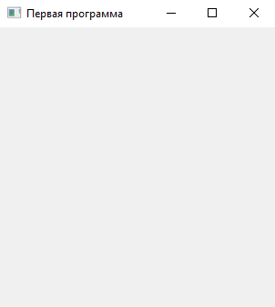
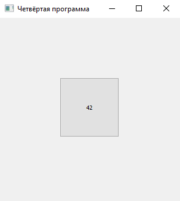
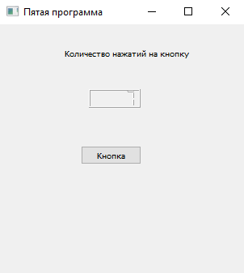
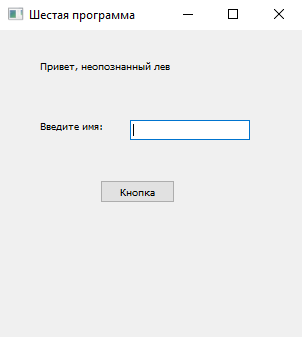
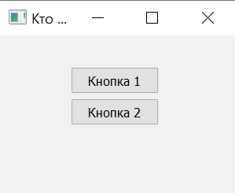
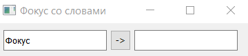
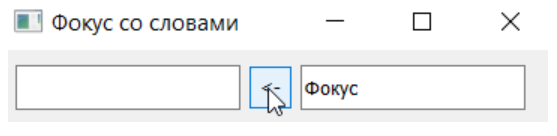
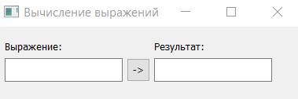
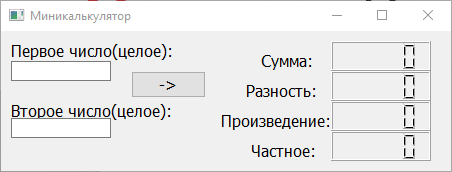
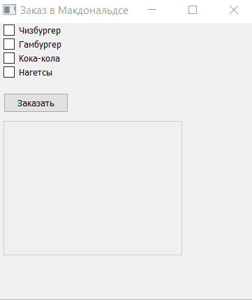

# Урок 1. Введение в PyQt6. Основы создания GUI-приложений

## Оглавление
1. [Что такое Qt и PyQt. Знакомство](#что-такое-qt-и-pyqt-знакомство)
2. [Графический интерфейс](#1-графический-интерфейс)
3. [Установка и настройка](#2-установка-и-настройка)
4. [Первые шаги в PyQt](#3-первые-шаги-в-pyqt)
5. [Кто отправил сигнал](#4-кто-отправил-сигнал)
6. [Открытие других форм](#5-открытие-других-форм)
7. [Итоги](#6-итоги)
8. [Задачи](#7-задачи)
9. [Домашнее задание](#8-домашнее-задание)

---

## Что такое Qt и PyQt. Знакомство

### 1. Графический интерфейс

Раньше большинство ваших программ запускались и выполнялись из консоли, то есть и ввод, и вывод осуществлялись с использованием интерфейса командной строки (CLI — Command Line Interface), без создания привычного пользовательского интерфейса (вы немного могли «поиграть» с графическим интерфейсом на дополнительном уроке по библиотеке tkinter).

Для программ, которые не предполагают того, что их будет использовать неподготовленный к работе с командной строкой пользователь, текстового интерфейса хватает. Существует большое количество консольных утилит, предназначенных для программистов или системных администраторов, но часто в жизни разработчика наступает момент, когда разработанную программу надо передать незнакомому с консолью пользователю. Графический интерфейс (GUI — Graphical User Interface) более «дружелюбный» к пользователям, а если в программе необходимо отображать не только текст, но и графическую или мультимедийную информацию, его использование становится необходимостью.

Рассмотрим основные понятия концепции GUI. Допустим, есть знакомый нам текстовый редактор. Когда мы нажимаем клавишу Х, возникает событие «Нажата клавиша Х». В то же время внутри программы запускается обработчик, который проверяет, какая клавиша нажата, какая раскладка выбрана и так далее. Затем он выполняет действие: выводит нужный символ на экран. Общий принцип работы можно представить в виде такой несложной схемы:

```
┌─────────────┐     ┌─────────────┐     ┌─────────────┐
│   Событие   │ ──► │  Обработчик │ ──► │   Действие  │
└─────────────┘     └─────────────┘     └─────────────┘
```

Для языка программирования Python есть много способов создания приложений с графическим интерфейсом, в частности, уже знакомая вам библиотека tkinter. Она используется в большом числе кроссплатформенных приложений, написанных на Python. Мы абсолютно ничего не имеем против tkinter, но в этом разделе курса будем рассматривать библиотеку PyQt, так как ее возможности значительно богаче. Разобраться с другими библиотеками для построения графических интерфейсов вы можете самостоятельно, так как они имеют похожий принцип работы. Кроме того, на схеме Событие → Обработчик → Действие в том или ином виде построены почти все современные библиотеки, предназначенные для взаимодействия с пользователем. В этом вы сможете убедиться самостоятельно в следующих разделах курса.

**Что же такое PyQt?**

Для начала разберемся, что такое Qt. Это написанная на C++ библиотека с классами для создания графического интерфейса. Библиотека получилась настолько удачной, что начала собирать вокруг себя большое сообщество программистов, которые разрабатывали приложения не только на C++, но и на других языках программирования. Это привело к тому, что и для других языков программирования стали появляться свои библиотеки-«обертки» для Qt. Для Python это PyQt.

---

### 2. Установка и настройка

PyQt устанавливается так же, как и любая другая библиотека в Python:

```bash
pip install PyQt6
```

**Важно!** Все примеры в данном курсе будут показаны на **PyQt6** (актуальная версия). Однако версии PyQt5 и PyQt4 тоже достаточно популярны. Несмотря на одинаковую идеологию, синтаксис разных версий может различаться.

**Особенности установки в Windows:**

Если вы работаете в операционной системе Windows, при запуске проектов может возникать ошибка вида `DLL not found`. Это происходит из-за того, что каталог, в который устанавливается Qt, не находится в путях системной переменной PATH. Причем при запуске с правами администратора такая ошибка не возникает.

Исправить ситуацию можно, дополнив содержимое системной переменной PATH. Библиотеки Qt устанавливаются в каталоге:
```
Каталог установки Python\lib\site-packages\PyQt6\Qt\bin
```

**Важное примечание о путях:**

При установке Python и PyQt надо учитывать, что в путях до Python не должно быть не-ASCII символов, например, кириллических. Это часто бывает в операционных системах Windows. Если все же в пути, по которому уже установлен Python, есть «неправильные» символы, то есть несколько способов это решить:

1. Переустановка Python в каталог с латинскими символами
2. Создать в PyCharm новый проект в пути только с «правильными» символами и активировать для такого проекта виртуальное окружение venv для Python, а затем установить PyQt уже в это виртуальное окружение

---

### 3. Первые шаги в PyQt

В терминологии PyQt (и достаточно большого числа других библиотек создания GUI) все графические приложения состоят из **виджетов**.

> **Виджет** — минимальный элемент графического интерфейса пользователя.

В библиотеке PyQt6 существует множество модулей, но чаще других используется `QtWidgets`. Именно в нем находятся классы, соответствующие различным элементам интерфейса.

#### Простейшая программа

Напишем простейшую программу с использованием библиотеки PyQt6:

```python
import sys

# Импортируем из PyQt6.QtWidgets классы для создания приложения и виджета
from PyQt6.QtWidgets import QApplication, QWidget


class Example(QWidget):
    def __init__(self):
        # Надо не забыть вызвать инициализатор базового класса
        super().__init__()
        # В метод initUI() будем выносить всю настройку интерфейса,
        # чтобы не перегружать инициализатор
        self.initUI()

    def initUI(self):
        # Зададим размер и положение нашего виджета
        self.setGeometry(300, 300, 300, 300)
        # А также его заголовок
        self.setWindowTitle('Первая программа')


if __name__ == '__main__':
    # Создадим класс приложения PyQt
    app = QApplication(sys.argv)
    # А теперь создадим и покажем пользователю экземпляр
    # нашего виджета класса Example
    ex = Example()
    ex.show()
    # Будем ждать, пока пользователь не завершил исполнение QApplication,
    # а потом завершим и нашу программу
    sys.exit(app.exec())
```



**Разбор программы:**

1. **Класс `Example`** наследуется от базового класса `QWidget`, который определяет простейшее окно
2. `super().__init__()` — вызывает конструктор родительского класса
3. Метод `initUI()` вынесен отдельно для настройки интерфейса (хорошая практика)
4. `setGeometry(x, y, width, height)` — задает положение и размеры окна
5. `setWindowTitle(title)` — задает заголовок окна

**Важно о PEP 8:**

Метод `initUI` называется с нарушением правил PEP 8 (должен быть `init_ui`). Такое отступление возможно для сохранения совместимости с используемой библиотекой. Так как библиотека Qt изначально написана на C++ с именованием методов в стиле `camelCase`, то `initUI` — допустимое название метода в классе, который унаследован от `QWidget`.

**Создание приложения:**

- `QApplication(sys.argv)` — создает объект приложения. Передавать `sys.argv` не обязательно, можно передать любой список, даже пустой. Но приведенная запись является хорошим тоном создания PyQt-приложений, так как она позволит корректно обрабатывать запуск приложения с параметрами командной строки
- `ex.show()` — отображает виджет
- `app.exec()` — запускает цикл обработки событий
- `sys.exit()` — обеспечивает корректное завершение программы

---

#### Добавляем кнопку

Просто пустое окно — это скучно, начнем добавлять туда виджеты. Первый на очереди — знакомая нам кнопка. Класс, который необходим для работы с ней, называется `QPushButton`.

```python
import sys

from PyQt6.QtWidgets import QApplication, QWidget, QPushButton


class Example(QWidget):
    def __init__(self):
        super().__init__()
        self.initUI()

    def initUI(self):
        self.setGeometry(300, 300, 300, 300)
        self.setWindowTitle('Вторая программа')
        
        # Создаем кнопку.
        # Передаем 2 параметра: надпись и виджет, на котором будет размещена кнопка
        btn = QPushButton('Кнопка', self)
        # Изменяем размер кнопки. Теперь он 100 на 100 пикселей
        btn.resize(100, 100)
        # Размещаем кнопку на родительском виджете по координатам (100, 100)
        btn.move(100, 100)


if __name__ == '__main__':
    app = QApplication(sys.argv)
    ex = Example()
    ex.show()
    sys.exit(app.exec())
```


**Важно:** у любого виджета, кроме базового, должен быть «родитель». Когда мы добавляем кнопку, «родителем» выступает наш виджет окна. Поэтому при объявлении кнопки мы указываем не только текст, но и экземпляр класса `QWidget` (или его наследника).

- `resize(width, height)` — изменяет размеры кнопки
- `move(x, y)` — задает расположение кнопки в виджете-«родителе»

---

#### Добавляем функциональность: сигналы и слоты

На кнопку можно даже понажимать, но пока безрезультатно. Сделаем ее полезной — добавим функциональность. В уже рассмотренных нами терминах — добавим **обработчик события** «нажатие на кнопку».

В библиотеке Qt используется своя терминология: **сигналы и слоты**.

> **Сигнал** вырабатывается, когда происходит определенное событие.
> **Слот** — это функция, которая ловит определенный сигнал.

**Ключевые особенности:**
- Все классы, наследуемые от `QObject` или его дочерних классов (например, `QWidget` и `QPushButton`), могут содержать сигналы и слоты
- Сигналы вырабатываются объектами, когда они изменяют свое состояние
- Объекты не знают и не заботятся о том, есть ли у его сигнала получатель
- Слоты — обычные функции (или методы класса), которые могут быть использованы для получения сигналов
- Можно подключать к одному слоту сколько угодно сигналов
- Один слот может быть подключен к неограниченному количеству сигналов
- Возможно подключать сигнал к другому сигналу

**Аналогия:** как радиотрансляция. Сигнал — это трансляция, радиостанции неизвестно, сколько радиоприемников-слотов будут настроены на волну. Но все настроенные приемники получат сигнал.

```python
import sys

from PyQt6.QtWidgets import QApplication, QWidget, QPushButton


class Example(QWidget):
    def __init__(self):
        super().__init__()
        self.initUI()

    def initUI(self):
        self.setGeometry(300, 300, 300, 300)
        self.setWindowTitle('Третья программа')

        self.btn = QPushButton('Кнопка', self)
        self.btn.resize(100, 100)
        self.btn.move(100, 100)
        # присоединим к событию нажатия на кнопку обработчик self.hello()
        self.btn.clicked.connect(self.hello)

    def hello(self):
        # метод setText() используется для задания надписи на кнопке
        self.btn.setText('Привет')


if __name__ == '__main__':
    app = QApplication(sys.argv)
    ex = Example()
    ex.show()
    sys.exit(app.exec())
```


**Что изменилось:**
- `btn` теперь — поле класса, а не локальная переменная
- `self.btn.clicked.connect(self.hello)` — подключаем сигнал `clicked` к слоту `hello`
- При нажатии на кнопку вызывается метод `hello()`, который меняет текст кнопки

---

#### Счетчик нажатий

Давайте выводить на кнопке не один и тот же текст каждый раз, а количество нажатий:

```python
import sys

from PyQt6.QtWidgets import QApplication, QWidget, QPushButton


class Example(QWidget):
    def __init__(self):
        super().__init__()
        self.initUI()

    def initUI(self):
        self.setGeometry(300, 300, 300, 300)
        self.setWindowTitle('Четвёртая программа')

        self.btn = QPushButton('0', self)
        self.btn.resize(100, 100)
        self.btn.move(100, 100)
        # Подпишем функцию-слот self.count() на сигнал clicked кнопки btn
        self.btn.clicked.connect(self.count)

    def count(self):
        # Не забываем, что надпись на кнопке - это текст.
        self.btn.setText(f"{int(self.btn.text()) + 1}")


if __name__ == '__main__':
    app = QApplication(sys.argv)
    ex = Example()
    ex.show()
    sys.exit(app.exec())
```



- `text()` — возвращает строку — текущую надпись на кнопке
- `setText()` — устанавливает новую надпись

---

#### Используем разные виджеты

Для отображения данных в PyQt есть и более подходящие виджеты:
- `QLabel` — для текстовых данных
- `QLCDNumber` — для цифр, имитирует дисплей калькулятора

```python
import sys

from PyQt6.QtWidgets import QApplication, QWidget, QPushButton
from PyQt6.QtWidgets import QLCDNumber, QLabel


class Example(QWidget):
    def __init__(self):
        super().__init__()
        self.initUI()

    def initUI(self):
        self.setGeometry(300, 300, 400, 400)
        self.setWindowTitle('Пятая программа')

        self.btn = QPushButton('Кнопка', self)
        # Подстроим размер кнопки под надпись на ней
        self.btn.resize(self.btn.sizeHint())
        self.btn.move(100, 150)
        # Обратите внимание: функцию не надо вызывать :)
        self.btn.clicked.connect(self.inc_click)

        self.label = QLabel(self)
        # Текст задается также, как и для кнопки
        self.label.setText("Количество нажатий на кнопку")
        self.label.move(80, 30)

        self.LCD_count = QLCDNumber(self)
        self.LCD_count.move(110, 80)

        self.count = 0

    def inc_click(self):
        self.count += 1
        # В QLCDNumber для отображения данных используется метод display()
        self.LCD_count.display(self.count)


if __name__ == '__main__':
    app = QApplication(sys.argv)
    ex = Example()
    ex.show()
    sys.exit(app.exec())
```



**Особенности QLCDNumber:**
- `display(value)` — отображает значение
- Может показывать символы: `O`, `S`, `g`, `-`, `.`, `A`, `B`, `C`, `D`, `E`, `F`, `h`, `H`, `L`, `o`, `P`, `r`, `u`, `U`, `Y`, кавычку, пробел
- Неподдерживаемые символы заменяются на пробелы

---

#### Ввод данных: QLineEdit

Для ввода данных пользователем используется `QLineEdit` (однострочное поле ввода):

```python
import sys

from PyQt6.QtWidgets import QApplication, QWidget, QPushButton
from PyQt6.QtWidgets import QLabel, QLineEdit


class Example(QWidget):
    def __init__(self):
        super().__init__()
        self.initUI()

    def initUI(self):
        self.setGeometry(300, 300, 400, 400)
        self.setWindowTitle('Шестая программа')

        self.btn = QPushButton('Кнопка', self)
        self.btn.resize(self.btn.sizeHint())
        self.btn.move(100, 150)
        self.btn.clicked.connect(self.hello)

        self.label = QLabel(self)
        self.label.setText("Привет, неопознанный лев")
        self.label.move(40, 30)

        self.name_label = QLabel(self)
        self.name_label.setText("Введите имя: ")
        self.name_label.move(40, 90)

        self.name_input = QLineEdit(self)
        self.name_input.move(150, 90)

    def hello(self):
        name = self.name_input.text()  # Получим текст из поля ввода
        self.label.setText(f"Привет, {name}")


if __name__ == '__main__':
    app = QApplication(sys.argv)
    ex = Example()
    ex.show()
    sys.exit(app.exec())
```



- `text()` — получает введенный текст
- `setText()` — устанавливает текст программно

---

### 4. Кто отправил сигнал

Если у нас одна функция-обработчик для нескольких кнопок, как понять, на какую из них нажал пользователь?

Чтобы определить, кто является источником сигнала, у виджета есть метод `.sender()`:

```python
import sys

from PyQt6.QtWidgets import QWidget, QApplication, QPushButton, QLabel


class Example(QWidget):
    def __init__(self):
        super().__init__()
        self.initUI()

    def initUI(self):
        self.setGeometry(300, 300, 300, 200)
        self.setWindowTitle('Кто отправил сигнал')

        self.button_1 = QPushButton(self)
        self.button_1.move(90, 40)
        self.button_1.setText("Кнопка 1")
        self.button_1.clicked.connect(self.run)

        self.button_2 = QPushButton(self)
        self.button_2.move(90, 80)
        self.button_2.setText("Кнопка 2")
        self.button_2.clicked.connect(self.run)

        self.label = QLabel(self)
        self.label.setText("Пока никто не отправлял")
        self.label.move(50, 120)

        self.show()

    def run(self):
        self.label.setText(self.sender().text())
        print(self.sender().text())


if __name__ == '__main__':
    app = QApplication(sys.argv)
    ex = Example()
    ex.show()
    sys.exit(app.exec())
```



**Объяснение:**
- Один слот `run()` привязан к сигналам от двух кнопок
- `self.sender()` возвращает объект, который отправил сигнал
- Мы можем получить его текст и отобразить в `QLabel`

---

### 5. Открытие других форм

Разумеется, далеко не всегда приложение ограничивается одной формой. В настоящих программах, как минимум, есть еще одна — «О программе», а также формы с настройками, диалоги открытия и сохранения файлов и так далее.

PyQt дает возможность в нашем приложении создавать формы из других форм. Обычно (но далеко не всегда) для главной формы приложения выбирают класс `QMainWindow`, а для дочерних форм — класс `QWidget`.

Чтобы создать форму из другой формы, достаточно сделать объект нужного нам класса и вызвать у него метод `show()`.

```python
import sys

from PyQt6.QtWidgets import QApplication, QWidget, QPushButton
from PyQt6.QtWidgets import QMainWindow, QLabel


class FirstForm(QMainWindow):
    def __init__(self):
        super().__init__()
        self.initUI()

    def initUI(self):
        self.setGeometry(300, 300, 300, 300)
        self.setWindowTitle('Главная форма')

        self.btn = QPushButton('Другая форма', self)
        self.btn.resize(self.btn.sizeHint())
        self.btn.move(100, 100)

        self.btn.clicked.connect(self.open_second_form)

    def open_second_form(self):
        self.second_form = SecondForm(self, "Данные для второй формы")
        self.second_form.show()


class SecondForm(QWidget):
    def __init__(self, *args):
        super().__init__()
        self.initUI(args)

    def initUI(self, args):
        self.setGeometry(300, 300, 300, 300)
        self.setWindowTitle('Вторая форма')
        self.lbl = QLabel(args[-1], self)
        self.lbl.adjustSize()


if __name__ == '__main__':
    app = QApplication(sys.argv)
    ex = FirstForm()
    ex.show()
    sys.exit(app.exec())
```

**Важно:** 
- Сохраняйте ссылку на дочернюю форму (например, `self.second_form`), иначе объект может быть удален сборщиком мусора
- `adjustSize()` — подгоняет размер виджета под содержимое

---

### 6. Итоги

На этом уроке мы изучили работу с основными виджетами:

| Виджет | Назначение |
|--------|------------|
| `QWidget` | Базовый класс для всех виджетов, пустое окно |
| `QPushButton` | Кнопка |
| `QLCDNumber` | Цифровой дисплей (как на калькуляторе) |
| `QLabel` | Текстовая метка |
| `QLineEdit` | Однострочное поле ввода |
| `QMainWindow` | Главное окно приложения (с меню, статус-баром) |

**Основные методы:**
- `setGeometry(x, y, w, h)` — задает положение и размеры
- `setWindowTitle(title)` — задает заголовок
- `resize(w, h)` — изменяет размеры
- `move(x, y)` — перемещает виджет
- `text()` — получает текст
- `setText(text)` — устанавливает текст
- `show()` — отображает виджет
- `clicked.connect(slot)` — подключает сигнал нажатия к слоту

**Важно:** Мы рассмотрели далеко не все доступные методы. Информацию о других методах можно посмотреть на [официальном сайте Qt](https://doc.qt.io/qt-6/). Обратите внимание: документация написана для языка C++, так что нужно обращать внимание лишь на названия методов и параметры, но не на синтаксис примеров.

---

### 7. Задачи

#### Задача 1. Фокус

Напишите «перекидыватель слов». На форме разместите два поля для ввода и кнопку. На кнопке должна быть показана стрелка от первого поля ко второму. В первое поле вводится строчка, по нажатию кнопки эта строчка перебрасывается в другое поле, при этом на кнопке меняется стрелка на противоположную. При повторном нажатии строчка летит обратно, а стрелка на кнопке меняется на изначальную. И так далее.





```python
import sys

from PyQt6.QtWidgets import QApplication, QWidget, QPushButton, QLineEdit


class Example(QWidget):
    def __init__(self):
        super().__init__()
        self.initUI()

    def initUI(self):
        self.setGeometry(300, 300, 310, 50)
        self.setWindowTitle('Фокус-покус')

        self.line1 = QLineEdit(self)
        self.line1.resize(120, 30)
        self.line1.move(10, 10)
        
        self.line2 = QLineEdit(self)
        self.line2.resize(120, 30)
        self.line2.move(180, 10)
        
        self.btn = QPushButton('->', self)
        self.btn.resize(30, 30)
        self.btn.move(140, 10)
        self.btn.clicked.connect(self.pokus)
        
        self.side = -1

    def pokus(self):
        self.side *= -1
        if self.side > 0:
            self.line2.setText(self.line1.text())
            self.line1.setText("")
            self.btn.setText('<-')
        else:
            self.line1.setText(self.line2.text())
            self.line2.setText("")
            self.btn.setText('->')


if __name__ == '__main__':
    app = QApplication(sys.argv)
    ex = Example()
    ex.show()
    sys.exit(app.exec())
```

---

#### Задача 2. Вычисление выражений

Напишите программу с графическим пользовательским интерфейсом на PyQt. В однострочное поле вводится корректное арифметическое выражение, которое можно вычислить без ошибок. По кнопке «Вычислить» надо посчитать результат этого выражения и вывести его в другое поле для ввода. Чтобы вычислить любое выражение, заданное в строке, можно использовать функцию `eval()`.

Пример: `1 + 2 * 3` → `7`



```python
import sys

from PyQt6.QtWidgets import QApplication, QWidget, QPushButton, QLineEdit


class Example(QWidget):
    def __init__(self):
        super().__init__()
        self.initUI()

    def initUI(self):
        self.setGeometry(300, 300, 310, 50)
        self.setWindowTitle('Вычисление выражений')

        self.line1 = QLineEdit(self)
        self.line1.resize(120, 30)
        self.line1.move(10, 10)
        
        self.line2 = QLineEdit(self)
        self.line2.resize(120, 30)
        self.line2.move(180, 10)
        
        self.btn = QPushButton('->', self)
        self.btn.resize(30, 30)
        self.btn.move(140, 10)
        self.btn.clicked.connect(self.pokus)

    def pokus(self):
        try:
            result = eval(self.line1.text())
            self.line2.setText(str(result))
        except Exception as e:
            self.line2.setText("Ошибка!")


if __name__ == '__main__':
    app = QApplication(sys.argv)
    ex = Example()
    ex.show()
    sys.exit(app.exec())
```

---

#### Задача 3. Миникалькулятор

Напишите программу с графическим пользовательским интерфейсом на PyQt, в которой в два текстовых поля вводятся целые числа. После нажатия кнопки «Рассчитать» программа должна вычислить сумму, разность, частное и произведение введенных чисел и вывести результат каждой операции в отдельные виджеты `QLCDNumber`. В случае попытки деления на 0 программа должна выводить какое-либо сообщение.



```python
import sys
from PyQt6.QtWidgets import QApplication, QWidget, QPushButton, QLabel, QLCDNumber, QLineEdit


class Example(QWidget):
    def __init__(self):
        super().__init__()
        self.initUI()

    def initUI(self):
        self.setGeometry(300, 300, 370, 120)
        self.setWindowTitle('Калькулятор')

        self.btn = QPushButton('Рассчитать', self)
        self.btn.resize(self.btn.sizeHint())
        self.btn.move(130, 40)
        self.btn.clicked.connect(self.calculate)

        self.label = QLabel(self)
        self.label.setText('Второе число(целое)')
        self.label.move(10, 10)
        
        self.label1 = QLabel(self)
        self.label1.setText('Первое число(целое)')
        self.label1.move(10, 60)

        self.number1_input = QLineEdit(self)
        self.number1_input.move(40, 30)
        self.number1_input.resize(60, 20)

        self.number2_input = QLineEdit(self)
        self.number2_input.move(40, 80)
        self.number2_input.resize(60, 20)

        self.label2 = QLabel(self)
        self.label2.setText('Сумма:')
        self.label2.move(220, 10)
        self.LSD_sum = QLCDNumber(self)
        self.LSD_sum.move(300, 10)
        self.LSD_sum.setSegmentStyle(QLCDNumber.SegmentStyle.Flat)

        self.label3 = QLabel(self)
        self.label3.setText('Разница:')
        self.label3.move(220, 34)
        self.LSD_dif = QLCDNumber(self)
        self.LSD_dif.move(300, 34)
        self.LSD_dif.setSegmentStyle(QLCDNumber.SegmentStyle.Flat)

        self.label4 = QLabel(self)
        self.label4.setText('Произведение:')
        self.label4.move(220, 58)
        self.LSD_product = QLCDNumber(self)
        self.LSD_product.move(300, 58)
        self.LSD_product.setSegmentStyle(QLCDNumber.SegmentStyle.Flat)

        self.label5 = QLabel(self)
        self.label5.setText('Частное:')
        self.label5.move(220, 82)
        self.LSD_div = QLCDNumber(self)
        self.LSD_div.move(300, 82)
        self.LSD_div.setSegmentStyle(QLCDNumber.SegmentStyle.Flat)

    def calculate(self):
        if self.number1_input.text() == '' or self.number2_input.text() == '':
            self.show_error()
            return
        
        try:
            a = int(self.number1_input.text())
            b = int(self.number2_input.text())
            
            self.LSD_sum.display(str(a + b))
            self.LSD_dif.display(str(a - b))
            self.LSD_product.display(str(a * b))
            
            if b == 0:
                self.LSD_div.display('Error')
            else:
                self.LSD_div.display(str(a / b))
        except ValueError:
            self.show_error()

    def show_error(self):
        self.LSD_sum.display('Error')
        self.LSD_dif.display('Error')
        self.LSD_div.display('Error')
        self.LSD_product.display('Error')


if __name__ == '__main__':
    app = QApplication(sys.argv)
    ex = Example()
    ex.show()
    sys.exit(app.exec())
```

---

### 8. Домашнее задание

#### Заказ в Макдональдсе

Напишите программу **«Заказ в Макдональдсе»** с графическим пользовательским интерфейсом на PyQt.

**Требования:**
- Пользователь должен иметь возможность выбирать одно или несколько блюд (используйте `QCheckBox` или `QRadioButton`)
- После нажатия на кнопку «Заказать» в отдельном виджете должен отображаться «чек» с выбранными позициями
- В качестве виджета для вывода информации о заказе используйте виджет `QPlainTextEdit`

**Примерный набор блюд:**
- Гамбургер — 150 руб.
- Чизбургер — 180 руб.
- Картофель фри — 100 руб.
- Кока-кола — 120 руб.
- Наггетсы (6 шт.) — 200 руб.

**Дополнительно (по желанию):**
- Добавьте возможность выбора количества каждого блюда (используйте `QSpinBox`)
- Добавьте итоговую сумму заказа
- Реализуйте кнопку «Очистить» для сброса заказа



**Пример структуры интерфейса:**
```
┌─────────────────────────────────────────────┐
│ Заказ в Макдональдсе                        │
├─────────────────────────────────────────────┤
│ □ Гамбургер (150 руб.)                      │
│ □ Чизбургер (180 руб.)                      │
│ □ Картофель фри (100 руб.)                  │
│ □ Кока-кола (120 руб.)                      │
│ □ Наггетсы (200 руб.)                       │
│                                             │
│ [Заказать]  [Очистить]                      │
│                                             │
│ ┌─────────────────────────────────────────┐ │
│ │ Чек:                                    │ │
│ │ Гамбургер - 150 руб.                    │ │
│ │ Картофель фри - 100 руб.                │ │
│ │ Итого: 250 руб.                         │ │
│ └─────────────────────────────────────────┘ │
└─────────────────────────────────────────────┘
```


