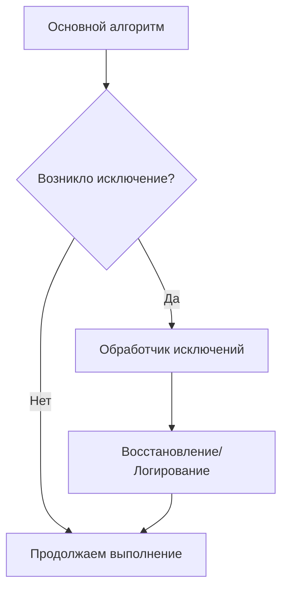
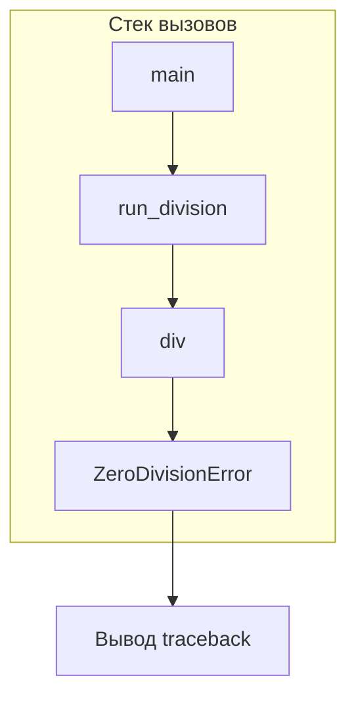
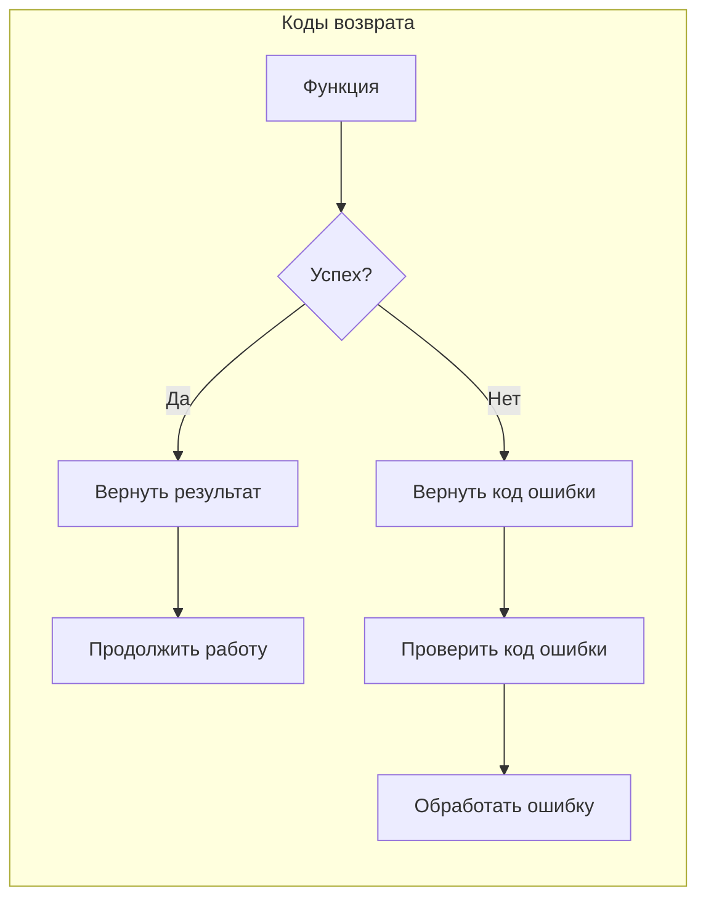
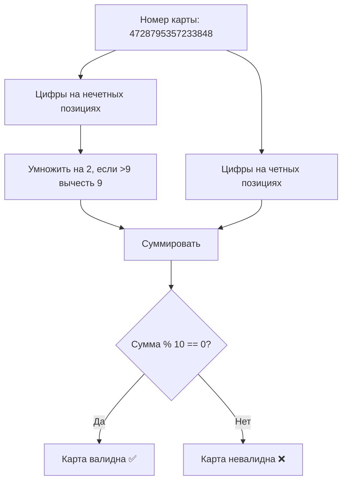
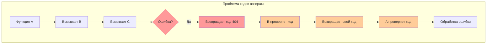
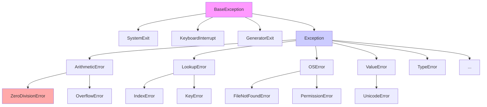
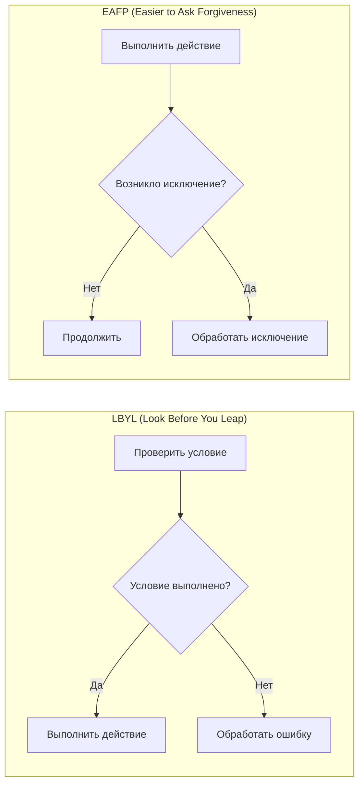
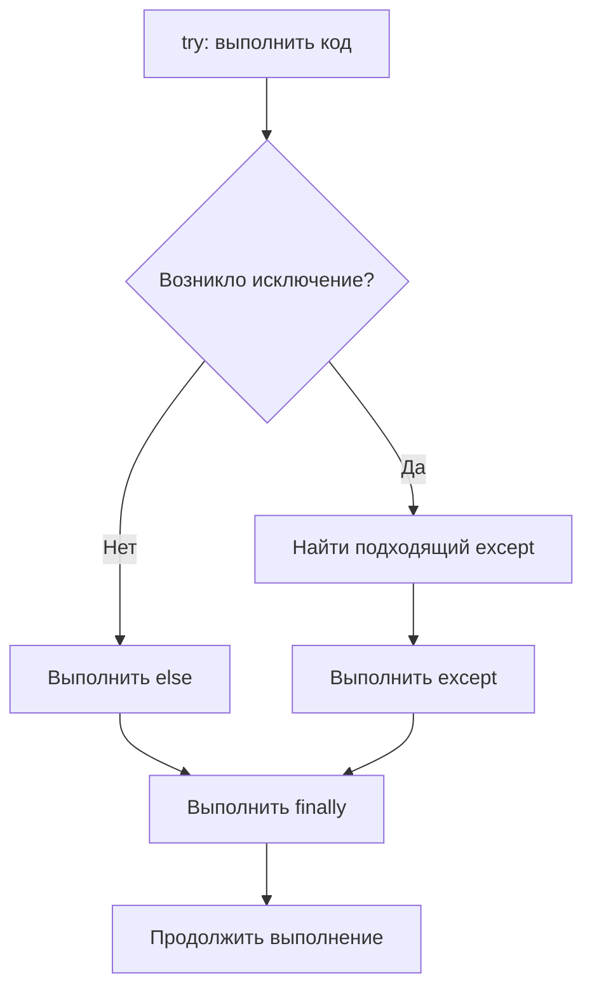
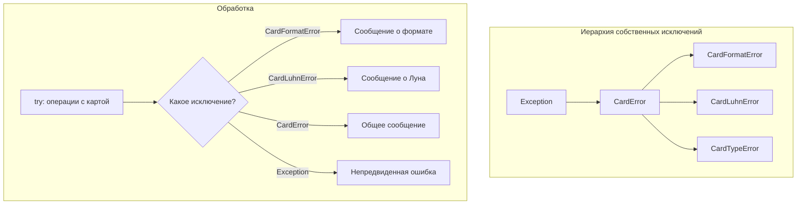
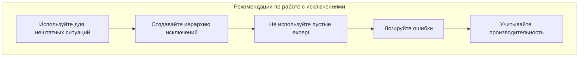

# Урок 3. QT. Исключения 📚

## 📑 Оглавление

1. [Понятие исключения. Обработка исключений. Собственные исключения](#понятие-исключения-обработка-исключений-собственные-исключения)
   - [Аннотация](#аннотация)
2. [Что такое ошибка или исключение](#что-такое-ошибка-или-исключение)
3. [Стек вызовов в Python](#стек-вызовов-в-python)
4. [Работа с кодами возврата](#работа-с-кодами-возврата)
5. [Пример: приложение для оплаты картой (PyQt6)](#пример-приложение-для-оплаты-картой-pyqt6)
   - [Алгоритм Луна для проверки номера карты](#алгоритм-луна-для-проверки-номера-карты)
   - [Добавляем проверку в приложение](#добавляем-проверку-в-приложение)
   - [Настройка обработки исключений в PyQt6](#настройка-обработки-исключений-в-pyqt6)
   - [Реализация с кодами возврата](#реализация-с-кодами-возврата)
6. [Трудности работы с кодами возврата](#трудности-работы-с-кодами-возврата)
7. [Обработка исключений](#обработка-исключений)
   - [Дерево встроенных исключений](#дерево-встроенных-исключений)
   - [Доступ к объекту исключения](#доступ-к-объекту-исключения)
   - [Переписываем приложение на PyQt6 с использованием исключений](#переписываем-приложение-на-pyqt6-с-использованием-исключений)
8. [Методики LBYL и EAFP](#методики-lbyl-и-eafp)
9. [Полный синтаксис блока try...except](#полный-синтаксис-блока-tryexcept)
10. [Создание пользовательских типов ошибок](#создание-пользовательских-типов-ошибок)
11. [Конструкция assert](#конструкция-assert)
12. [Практические примеры на PyQt6](#практические-примеры-на-pyqt6)
    - [Пример 1: Обработка ошибок ввода в QLineEdit](#пример-1-обработка-ошибок-ввода-в-qlineedit)
    - [Пример 2: Работа с файлами с использованием finally](#пример-2-работа-с-файлами-с-использованием-finally)
    - [Пример 3: Использование EAFP в PyQt6](#пример-3-использование-eafp-в-pyqt6)
    - [Пример 4: Собственные исключения в PyQt6 приложении](#пример-4-собственные-исключения-в-pyqt6-приложении)
    - [Пример 5: Множественные except и finally в сложном приложении](#пример-5-множественные-except-и-finally-в-сложном-приложении)
13. [Задания для самостоятельной работы](#задания-для-самостоятельной-работы)
    - [Задание 1: Проверка ввода телефона 📱](#задание-1-проверка-ввода-телефона-)
    - [Задание 2: Сохранение данных с подтверждением 💾](#задание-2-сохранение-данных-с-подтверждением-)
    - [Задание 3: Поиск товара в корзине 🛒](#задание-3-поиск-товара-в-корзине-)
    - [Задание 4: Валидация банковской карты 💳](#задание-4-валидация-банковской-карты-)
    - [Задание 5: Калькулятор с историей операций 🧮](#задание-5-калькулятор-с-историей-операций-)
14. [Заключение](#заключение)

---

## Понятие исключения. Обработка исключений. Собственные исключения

### Аннотация
Урок рассказывает о работе с исключениями в современных языках программирования, в частности, в языке Python, в контексте разработки GUI-приложений на PyQt6. Рассматривается сравнение методики исключений с методикой кодов возврата, построение собственных классов исключений и их наследование, методики LBYL и EAFP. Особое внимание уделяется практическому применению этих концепций в приложениях с графическим интерфейсом.

---

## Что такое ошибка или исключение

У вашей программы есть «главная» ветка — то, что относится к основному алгоритму. Именно ей вы уделяете основное внимание.

Обычно программа быстро обрастает проверочным кодом, засоряющим главный алгоритм. Так происходит, потому что при использовании программы появляется все больше нюансов и зависимостей от внешних параметров.

Во время работы программы иногда возникают непредвиденные обстоятельства («упс, что-то пошло не так») — как правило, внешние. Программа должна их верно обрабатывать. Мы будем называть такие обстоятельства ошибками или исключениями.



Чтобы было понятнее, рассмотрим пример алгоритма посещения магазина.

Родители посылают дочь в магазин и просят купить молока некоторого бренда ценой 40 рублей. Это и есть для девочки основной алгоритм в данной ситуации. Однако могут возникнуть непредвиденные обстоятельства: именно этот магазин сейчас закрыт (нужно ли тратить время и идти в следующий?), такого молока в продаже нет (вернуться обратно или купить другое?), молоко подорожало (все равно брать?), заканчивается срок годности (это важно?) и так далее.

Все это можно обсудить сразу, но нужно соблюдать меру и не раздувать алгоритм покупок до инструкции на 30 страниц, включающей подробные указания на случай стихийных бедствий.

Лучше всего решить, что делать в тех случаях, которые легко предугадать. Все остальное свести к универсальному решению «вернуться обратно» или «позвонить родителям и спросить».

То же самое и в программировании.

Например, вы написали алгоритм, скачивающий плейлист из ВКонтакте в папку на компьютере. Запустили его. Что же может пойти не так?

- Проблемы с доступом в Интернет 🌐
- Сервера ВКонтакте работают нестабильно и не отвечают
- Если алгоритм дает имена файлам по названиям треков, то ему могут попасться недопустимые символы
- Закончилось свободное место на диске 💾
- ...

Есть несколько путей:
1. В любом непредвиденном случае программа остановится, а вы увидите сообщение об ошибке (так Python работает по умолчанию)
2. Вы добавляете автоматическую обработку некоторых известных вам проблем
3. Программа будет каждый раз спрашивать вас о том, как поступить в возникшей нештатной ситуации
4. Комбинация этих решений

Если мы хотим, чтобы программа работала с широким диапазоном входных данных и внешних условий, то надо учитывать исключения.

Отметим еще раз, что по умолчанию от необработанной ошибки программа на Python немедленно останавливается и выводит сообщение:

```python
for i in range(10):
    print(10 / i)
```
```
Traceback (most recent call last):
  File "/home/02.py", line 2, in <module>
    print(10 / i)
ZeroDivisionError: division by zero
```

---

## Стек вызовов в Python

Теперь поговорим немного про стек вызовов (traceback). Программа на Python состоит из блоков, входящих один в другой, поэтому у любой точки программы есть вложенность. Давайте посмотрим, какую информацию дает стек вызовов, когда указывает на место ошибки.



Например, вычисление частного двух чисел, введенных пользователем. Отметим, что огромное количество ошибок происходит из-за того, что пользователь ввел неправильные данные.

Проведем три эксперимента:
1. Введем правильные числа ✅
2. Введем второе число, равное 0 ⚠️
3. Введем не число, а строку ❌

```python
def div(a, b):
    return a / b

def run_division():
    a = float(input("Введите a: "))
    b = float(input("Введите b: "))
    print(div(a, b))

run_division()
```

**Успешный запуск:**
```
Введите a: 45
Введите b: 11
4.090909090909091
```

**Ошибка деления на ноль:**
```
Введите a: 45
Введите b: 0
Traceback (most recent call last):
  File "/home/01.py", line 11, in <module>
    run_division()
  File "/home/01.py", line 8, in run_division
    print(div(a, b))
  File "/home/01.py", line 2, in div
    return a / b
ZeroDivisionError: float division by zero
```

**Ошибка преобразования типа:**
```
Введите a: fd
Traceback (most recent call last):
  File "/home/01.py", line 11, in <module>
    run_division()
  File "/home/01.py", line 6, in run_division
    a = float(input("Введите a: "))
ValueError: could not convert string to float: 'fd'
```

Печать стека вызовов в момент аварийного завершения программы помогает нам найти ошибку. Мы слишком понадеялись на то, что пользователь введет только вещественные числа в европейском формате (с точкой в качестве десятичного разделителя). Кроме того, не все помнят, что на 0 делить нельзя (по крайней мере, в Python).

---

## Работа с кодами возврата

Этот тип работы с исключениями первым появился в истории программирования. Его следы остались в некоторых функциях Python — языка, который унаследовал механику у С.

Например, метод `find` строки ищет позицию вхождения подстроки в заданную строчку. Он возвращает либо номер позиции, либо −1, если такой подстроки нет.

```python
s = "Привет, мир!"
print(s.find(","))  # 6
print(s.find("Д"))  # -1
```

Из-за того, что в исходной строке не было символа «Д», нам было возвращено значение −1. Это и есть код возврата. Так как любая функция в Python возвращает значения, мы можем использовать их для кодирования информации об ошибке.



Для каждой ошибки можно придумать свой код возврата. Коды не должны совпадать с возможными обычными ответами.

В больших информационных системах у каждой ситуации, в том числе и у нештатной, есть свой номер. Например, у ошибок в Интернете: 404, 503. А 200 — это код, возвращаемый серверами при успешном выполнении задания.

С кодами возврата вы, наверняка, достаточно часто сталкивались на предыдущих двух уроках при использовании библиотеки PyQt, так как Qt написана на C++. Мы пишем строчку `sys.exit(app.exec())` при создании приложения в том числе и для того, чтобы в случае ошибки получить код возврата библиотеки PyQt.

---

## Пример: приложение для оплаты картой (PyQt6)

Давайте рассмотрим пример использования кодов возврата в реальном приложении на PyQt6.

У нас есть приложение с возможностью оплаты картой каких-либо товаров или услуг (например, премиум-подписки). Просим пользователя ввести номер карты.

**Форма приложения (pay.ui):**
```xml
<?xml version="1.0" encoding="UTF-8"?>
<ui version="4.0">
 <class>PayForm</class>
 <widget class="QWidget" name="PayForm">
  <property name="geometry">
   <rect>
    <x>0</x>
    <y>0</y>
    <width>400</width>
    <height>200</height>
   </rect>
  </property>
  <property name="windowTitle">
   <string>Оплата картой</string>
  </property>
  <layout class="QVBoxLayout" name="verticalLayout">
   <item>
    <widget class="QLabel" name="hintLabel">
     <property name="text">
      <string>Введите номер карты:</string>
     </property>
    </widget>
   </item>
   <item>
    <widget class="QLineEdit" name="cardData"/>
   </item>
   <item>
    <widget class="QPushButton" name="payButton">
     <property name="text">
      <string>Оплатить</string>
     </property>
    </widget>
   </item>
   <item>
    <widget class="QLabel" name="errorLabel">
     <property name="text">
      <string/>
     </property>
    </widget>
   </item>
  </layout>
 </widget>
</ui>
```

**Базовая программа:**
```python
import sys
from PyQt6 import uic
from PyQt6.QtWidgets import QWidget, QApplication

class PayForm(QWidget):
    def __init__(self):
        super(PayForm, self).__init__()
        uic.loadUi('pay.ui', self)
        self.payButton.clicked.connect(self.get_data)

    def get_data(self):
        card_num = self.cardData.text()
        print(card_num)

if __name__ == '__main__':
    app = QApplication(sys.argv)
    form = PayForm()
    form.show()
    sys.exit(app.exec())
```

Но здесь нас подстерегает несколько неожиданностей. Пользователь не знает формата, в котором нужен номер карты. Просто цифры без пробела? Или группами по четыре с пробелами, как на карте?

Можно написать ему об этом:

```python
self.hintLabel.setText('Введите номер карты (16 цифр без пробелов):')
```

Но и теперь мы не застрахованы от ошибок — пользователь может набрать букву O вместо нуля, перепутать цифры, не прочитать внимательно инструкцию и ввести пробелы или просто начать целенаправленно взламывать нашу программу (это называется фаззинг, fuzzing).

### Алгоритм Луна для проверки номера карты

Ситуацию усложняет то, что номера карт — не просто случайный набор из 16 цифр.

- Первая цифра обозначает тип карты (Visa — 4, MasterCard — 5)
- Следующие пять обозначают банк, который выпустил карту
- Другие девять цифр — уникальный номер конкретной карты
- Последнюю, шестнадцатую цифру, называют контрольной

Номер должен проходить проверку специальным алгоритмом Лу́на. Его придумал немецкий инженер Ганс Питер Лун.

**Как работает алгоритм Луна:**

1. Каждую цифру в нечетной позиции, начиная с первого числа слева, умножаем на два. Если результат больше 9, складываем обе цифры этого двузначного числа (или вычитаем 9)
2. Складываем все результаты и цифры на четных позициях — в том числе и последнюю контрольную цифру
3. Если сумма кратна 10, то номер карты правильный



```python
def luhn_algorithm(self, card):
    def double(x):
        res = x * 2
        return res - 9 if res > 9 else res
    
    odd = map(lambda x: double(int(x)), card[::2])
    even = map(int, card[1::2])
    return (sum(odd) + sum(even)) % 10 == 0
```

### Добавляем проверку в приложение

```python
import sys
from PyQt6 import uic
from PyQt6.QtWidgets import QWidget, QApplication

class PayForm(QWidget):
    def __init__(self):
        super(PayForm, self).__init__()
        uic.loadUi('pay.ui', self)
        self.hintLabel.setText('Введите номер карты (16 цифр без пробелов):')
        self.payButton.clicked.connect(self.process_data)

    def get_card_number(self):
        card_num = self.cardData.text()
        return card_num

    def double(self, x):
        res = x * 2
        if res > 9:
            res = res - 9
        return res

    def luhn_algorithm(self, card):
        odd = map(lambda x: self.double(int(x)), card[::2])
        even = map(int, card[1::2])
        return (sum(odd) + sum(even)) % 10 == 0

    def process_data(self):
        number = self.get_card_number()
        if self.luhn_algorithm(number):
            self.errorLabel.setText("Ваша карта обрабатывается...")
```

Однако если пользователь введет не 16 цифр, а что-нибудь другое, или 16 цифр, разделенных пробелами, то он обрушит программу.

### Настройка обработки исключений в PyQt6

PyQt6 по умолчанию «замалчивает» необработанные ошибки. Внесем изменения в код нашей программы, чтобы это исправить. **В дальнейшем вставляйте этот код во все свои приложения на PyQt6:**

```python
def except_hook(cls, exception, traceback):
    sys.__excepthook__(cls, exception, traceback)

if __name__ == '__main__':
    app = QApplication(sys.argv)
    form = PayForm()
    form.show()
    sys.excepthook = except_hook
    sys.exit(app.exec())
```

### Реализация с кодами возврата

Теперь сделаем так, чтобы в ответ на некорректный запрос программа не «падала», а требовала ввести 16 цифр, произвольно разделенных пробелами. Для этого метод `get_card_number` будет возвращать специальный код — например, 404, как в Интернете.

```python
import sys
from PyQt6 import uic
from PyQt6.QtWidgets import QWidget, QApplication

class PayForm(QWidget):
    def __init__(self):
        super(PayForm, self).__init__()
        uic.loadUi('pay.ui', self)
        self.hintLabel.setText('Введите номер карты (16 цифр):')
        self.payButton.clicked.connect(self.process_data)

    def get_card_number(self):
        card_num = self.cardData.text()
        # Удаляем пробелы
        card_num = ''.join(card_num.split())
        if card_num.isdigit() and len(card_num) == 16:
            return card_num
        else:
            return 404  # Код ошибки

    def double(self, x):
        res = x * 2
        if res > 9:
            res = res - 9
        return res

    def luhn_algorithm(self, card):
        odd = map(lambda x: self.double(int(x)), card[::2])
        even = map(int, card[1::2])
        return (sum(odd) + sum(even)) % 10 == 0

    def process_data(self):
        number = self.get_card_number()
        if number == 404:
            self.errorLabel.setText("Введите только 16 цифр. Допускаются пробелы")
        elif self.luhn_algorithm(number):
            self.errorLabel.setText("Ваша карта обрабатывается...")
        else:
            self.errorLabel.setText("Номер недействителен. Попробуйте снова.")

def except_hook(cls, exception, traceback):
    sys.__excepthook__(cls, exception, traceback)

if __name__ == '__main__':
    app = QApplication(sys.argv)
    form = PayForm()
    form.show()
    sys.excepthook = except_hook
    sys.exit(app.exec())
```

---

## Трудности работы с кодами возврата

Мы видим, что даже простая функция для обработки пользовательских данных обрастает дополнительным кодом, проверкой многих условий и «магическими» кодами возврата (404). Если функция с кодом возврата находится глубоко в стеке вызовов, то придется сделать так, чтобы ее правильно обрабатывала вся вышестоящая цепочка функций. Каждая из них должна принимать код и возвращать свой.



Чтобы упростить обработку ошибок, программисты стали работать с исключениями как с объектами.

---

## Обработка исключений

В Python и других объектно-ориентированных языках исключения — такие же объекты в программе, как и все остальное. Исключение создается в любом месте и поднимается по стеку вызовов, пока его не отловит какой-нибудь код-обработчик.

```python
s = "3434"
s.index("9")
```
```
Traceback (most recent call last):
  File "/home/06.py", line 2, in <module>
    s.index("9")
ValueError: substring not found
```

Обратите внимание: «поймав» исключение, очень легко определить его тип. Он выведется на экран.

Такое сообщение об ошибке означает, что метод `index` породил исключение — объект типа `ValueError`. Все функции стека вызовов получили уведомление о нештатной ситуации. Если ни одна из них не отреагирует, программа аварийно завершится.

Исключения ловят в специальном блоке `try...except`:

```python
try:
    a = int(input("Введите целое число: "))
    print(a + 10)
except ValueError:
    print("Неверное число")
```
```
Введите целое число: 11df
Неверное число
```

Функция `int` порождает исключение `ValueError` (неверное значение), когда в строке есть посторонние символы (например, буквы).

### Дерево встроенных исключений

Так как исключения — это классы, то они могут быть наследниками друг друга. Обработчик поймает не только указанные исключения, но и всех их наследников.



Дерево встроенных исключений выглядит так:

```
BaseException
 +-- SystemExit
 +-- KeyboardInterrupt
 +-- GeneratorExit
 +-- Exception
      +-- StopIteration
      +-- StopAsyncIteration
      +-- ArithmeticError
      |    +-- FloatingPointError
      |    +-- OverflowError
      |    +-- ZeroDivisionError
      +-- AssertionError
      +-- AttributeError
      +-- BufferError
      +-- EOFError
      +-- ImportError
      |    +-- ModuleNotFoundError
      +-- LookupError
      |    +-- IndexError
      |    +-- KeyError
      +-- MemoryError
      +-- NameError
      |    +-- UnboundLocalError
      +-- OSError
      |    +-- FileExistsError
      |    +-- FileNotFoundError
      |    +-- PermissionError
      |    +-- ...
      +-- RuntimeError
      +-- SyntaxError
      +-- TypeError
      +-- ValueError
      |    +-- UnicodeError
      +-- Warning
           +-- ...
```

### Доступ к объекту исключения

Если нужен доступ к исключению как к объекту, пригодится такая конструкция:

```python
try:
    a = int(input("Введите целое число: "))
    print(a + 10)
except ValueError as ve:
    print("Неверное число")
    print(ve)  # invalid literal for int() with base 10: 'fff'
    print(dir(ve))  # список всех атрибутов объекта
```

### Переписываем приложение на PyQt6 с использованием исключений

Перепишем задачу ввода карты вместе с исключениями. Там, где нужно было использовать код возврата, вставим конструкцию `raise` (генерация объекта-исключения заданного типа).

```python
import sys
from PyQt6 import uic
from PyQt6.QtWidgets import QWidget, QApplication

class PayForm(QWidget):
    def __init__(self):
        super(PayForm, self).__init__()
        uic.loadUi('pay.ui', self)
        self.hintLabel.setText('Введите номер карты (16 цифр):')
        self.payButton.clicked.connect(self.process_data)

    def get_card_number(self):
        card_num = self.cardData.text()
        # Удаляем пробелы
        card_num = ''.join(card_num.split())
        if not (card_num.isdigit() and len(card_num) == 16):
            raise ValueError("Неверный формат номера")
        return card_num

    def double(self, x):
        res = x * 2
        if res > 9:
            res = res - 9
        return res

    def luhn_algorithm(self, card):
        odd = map(lambda x: self.double(int(x)), card[::2])
        even = map(int, card[1::2])
        if (sum(odd) + sum(even)) % 10 == 0:
            return True
        else:
            raise ValueError("Недействительный номер карты")

    def process_data(self):
        try:
            number = self.get_card_number()
            if self.luhn_algorithm(number):
                self.errorLabel.setText("Ваша карта обрабатывается...")
        except ValueError as e:
            self.errorLabel.setText(f"Ошибка! {e}")

def except_hook(cls, exception, traceback):
    sys.__excepthook__(cls, exception, traceback)

if __name__ == '__main__':
    app = QApplication(sys.argv)
    form = PayForm()
    form.show()
    sys.excepthook = except_hook
    sys.exit(app.exec())
```

**Преимущества подхода с исключениями:**
- Код становится короче и чище ✨
- Не надо ставить конструкции `if` во всем стеке вызовов
- Работа с ошибками становится гибче благодаря дереву исключений
- Мы можем работать с системными исключениями (например, с прерыванием по нажатию на клавишу) так же легко, как с собственными

---

## Методики LBYL и EAFP

Когда мы изучаем исключения, то с их помощью хочется обрабатывать вообще все внештатные ситуации, максимально очищая код от дополнительных условий-проверок.

Есть два крайних подхода:

### LBYL (Look Before You Leap — «Посмотри перед прыжком»)
Сначала проверяем, что все получится, потом выполняем действие.

```python
mydict = {'Elizabeth': 12, 'Ivan': 145}
if 'Ivan' in mydict:
    mydict['Ivan'] += 1
```

### EAFP (Easier to Ask Forgiveness than Permission — «Проще извиниться, чем спросить разрешения»)
Пытаемся выполнить действие, а если возникает ошибка — обрабатываем её.

```python
try:
    mydict['Ivan'] += 1
except KeyError:
    pass
```



В Python преобладает EAFP-подход, особенно если речь идет о стандартных исключениях и действиях с данными внутри них. В коде многопоточной программы лучше использовать EAFP, так как один поток может неожиданно изменить данные, которые только что проверил другой.

**В контексте PyQt6:** EAFP особенно полезен при работе с виджетами, когда мы не уверены, существует ли определенный элемент интерфейса или имеет ли он нужные свойства.

---

## Полный синтаксис блока try...except

Блок `try...except` может выглядеть существенно сложнее:

```python
s = [(1, 2), (4, 7), (1, 0), (13, None)]

for i in range(10):
    try:
        x, y = s[i]
        print(x / y)
    except IndexError:
        print('Мы за границей списка')
    except ZeroDivisionError as e:
        print('Поделили на 0')
    except Exception as e:
        print('Непредвиденная ошибка %s' % e)
    else:
        print('Всё хорошо')
    finally:
        print('Идём дальше')
```



**Важные моменты:**
- К одному `try` может быть прикреплено несколько `except`
- Блок `finally` выполняется **всегда**, даже если программа прервется внешним исключением или операторами `break`/`continue`
- Порядок перечисления исключений важен — перебор закончится на первом же подходящем блоке
- Блок `else` выполняется, если ни один из блоков `except` не подошел

**Ошибка, которую часто допускают:**
```python
try:
    # какой-то код
except Exception:
    pass  # Никогда так не делайте!
```
Если вы не логируете ошибки (в файл, базу данных) и не регистрируете сам их факт, программу тяжело отлаживать — она может выдавать неверные результаты, но неизменно отчитываться, что все в порядке.

---

## Создание пользовательских типов ошибок

Исключение — это объект. Мы можем дополнять дерево исключений собственными так же, как делаем это с любыми другими классами.

Если мы пишем большой модуль (особенно на PyQt6), нам почти всегда требуется собственная иерархия объектов-исключений. Как правило, новые объекты наследуют классу `Exception`.

### Пример с собственными исключениями в PyQt6 приложении

Вернемся к примеру с проверкой банковской карты и добавим несколько собственных исключений:

```python
import sys
from PyQt6 import uic
from PyQt6.QtWidgets import QWidget, QApplication

# Создаем иерархию собственных исключений
class CardError(Exception):
    """Базовое исключение для ошибок карты"""
    pass

class CardFormatError(CardError):
    """Ошибка формата номера карты"""
    pass

class CardLuhnError(CardError):
    """Ошибка проверки по алгоритму Луна"""
    pass

class PayForm(QWidget):
    def __init__(self):
        super(PayForm, self).__init__()
        uic.loadUi('pay.ui', self)
        self.hintLabel.setText('Введите номер карты (16 цифр):')
        self.payButton.clicked.connect(self.process_data)

    def get_card_number(self):
        card_num = self.cardData.text()
        # Удаляем пробелы
        card_num = ''.join(card_num.split())
        if not (card_num.isdigit() and len(card_num) == 16):
            raise CardFormatError("Неверный формат номера")
        return card_num

    def double(self, x):
        res = x * 2
        if res > 9:
            res = res - 9
        return res

    def luhn_algorithm(self, card):
        odd = map(lambda x: self.double(int(x)), card[::2])
        even = map(int, card[1::2])
        if (sum(odd) + sum(even)) % 10 == 0:
            return True
        else:
            raise CardLuhnError("Недействительный номер карты")

    def process_data(self):
        try:
            number = self.get_card_number()
            if self.luhn_algorithm(number):
                self.errorLabel.setText("Ваша карта обрабатывается...")
        except CardFormatError as e:
            self.errorLabel.setText(f"Ошибка формата: {e}")
        except CardLuhnError as e:
            self.errorLabel.setText(f"Ошибка проверки: {e}")
        except CardError as e:
            # Ловим все остальные ошибки, связанные с картой
            self.errorLabel.setText(f"Ошибка карты: {e}")
        except Exception as e:
            # Ловим любые другие непредвиденные ошибки
            self.errorLabel.setText(f"Непредвиденная ошибка: {e}")
            # Логируем для отладки
            print(f"Необработанная ошибка: {e}")

def except_hook(cls, exception, traceback):
    sys.__excepthook__(cls, exception, traceback)

if __name__ == '__main__':
    app = QApplication(sys.argv)
    form = PayForm()
    form.show()
    sys.excepthook = except_hook
    sys.exit(app.exec())
```

**Почему классы-исключения «пустые»?**
Они содержат только `pass`, потому что нам не нужна дополнительная логика — достаточно самого факта существования разных типов исключений для их различения при обработке.



---

## Конструкция assert

Конструкция `assert` — это часть Python, связанная с тестированием.

```python
s = [1, 2, 34, 54, 3]
assert len(s) == 4
```
```
Traceback (most recent call last):
  File "/home/01.py", line 2, in <module>
    assert len(s) == 4
AssertionError
```

Блок работает так:
- Если выражение верное — ничего не происходит
- Если нет — создается исключение `AssertionError`

Можно добавить сообщение:
```python
assert len(s) == 4, f"Длина списка {len(s)}, а должна быть 4"
```

Интерпретатор Python можно запустить с опцией `-O` — тогда он будет пропускать блоки `assert`. Это позволяет включать и выключать отладочные проверки.

**В PyQt6 приложениях `assert` полезен для:**
- Проверки наличия виджетов в интерфейсе
- Проверки типов данных перед обработкой
- Верификации состояния приложения в процессе разработки

```python
def load_ui(self):
    uic.loadUi('main.ui', self)
    # Проверяем, что все необходимые виджеты загрузились
    assert hasattr(self, 'payButton'), "В UI нет кнопки payButton"
    assert hasattr(self, 'cardData'), "В UI нет поля cardData"
```

---

## Практические примеры на PyQt6

### Пример 1: Обработка ошибок ввода в QLineEdit 🎯

**Описание:** Создайте форму с полем ввода возраста. При нажатии на кнопку программа должна проверить, что введено целое число от 0 до 120. Если данные некорректны — вывести сообщение об ошибке в QLabel.

**Решение:**
```python
import sys
from PyQt6 import uic
from PyQt6.QtWidgets import QWidget, QApplication, QMessageBox

class AgeForm(QWidget):
    def __init__(self):
        super().__init__()
        uic.loadUi('age.ui', self)  # Предполагается, что есть QLineEdit ageInput, QPushButton checkButton, QLabel resultLabel
        self.checkButton.clicked.connect(self.check_age)

    def check_age(self):
        try:
            age = int(self.ageInput.text())
            if 0 <= age <= 120:
                self.resultLabel.setText(f"Возраст {age} лет — корректный")
                self.resultLabel.setStyleSheet("color: green")
            else:
                raise ValueError("Возраст должен быть от 0 до 120")
        except ValueError as e:
            self.resultLabel.setText(f"Ошибка: {e}")
            self.resultLabel.setStyleSheet("color: red")
        except Exception as e:
            self.resultLabel.setText(f"Непредвиденная ошибка: {e}")
            self.resultLabel.setStyleSheet("color: red")

def except_hook(cls, exception, traceback):
    sys.__excepthook__(cls, exception, traceback)

if __name__ == '__main__':
    app = QApplication(sys.argv)
    window = AgeForm()
    window.show()
    sys.excepthook = except_hook
    sys.exit(app.exec())
```

---

### Пример 2: Работа с файлами с использованием finally 📁

**Описание:** Приложение открывает текстовый файл, читает его содержимое и отображает в QTextEdit. В случае ошибки (файл не найден, нет прав доступа) выводится сообщение. Блок `finally` используется для закрытия файла и вывода сообщения о завершении операции.

**Решение:**
```python
import sys
from PyQt6 import uic
from PyQt6.QtWidgets import QWidget, QApplication, QFileDialog, QMessageBox

class FileReader(QWidget):
    def __init__(self):
        super().__init__()
        uic.loadUi('filereader.ui', self)  # QPushButton openButton, QTextEdit textEdit
        self.openButton.clicked.connect(self.open_file)

    def open_file(self):
        file_path, _ = QFileDialog.getOpenFileName(self, "Выберите файл", "", "Text files (*.txt)")
        if not file_path:
            return
        
        file_handle = None
        try:
            file_handle = open(file_path, 'r', encoding='utf-8')
            content = file_handle.read()
            self.textEdit.setPlainText(content)
            self.textEdit.setStyleSheet("")
        except FileNotFoundError:
            self.textEdit.setPlainText("Ошибка: Файл не найден")
            self.textEdit.setStyleSheet("color: red")
        except PermissionError:
            self.textEdit.setPlainText("Ошибка: Нет прав на чтение файла")
            self.textEdit.setStyleSheet("color: red")
        except UnicodeDecodeError:
            self.textEdit.setPlainText("Ошибка: Не удалось декодировать файл (неверная кодировка)")
            self.textEdit.setStyleSheet("color: red")
        except Exception as e:
            self.textEdit.setPlainText(f"Непредвиденная ошибка: {e}")
            self.textEdit.setStyleSheet("color: red")
        finally:
            if file_handle:
                file_handle.close()
                print("Файл закрыт")

def except_hook(cls, exception, traceback):
    sys.__excepthook__(cls, exception, traceback)

if __name__ == '__main__':
    app = QApplication(sys.argv)
    window = FileReader()
    window.show()
    sys.excepthook = except_hook
    sys.exit(app.exec())
```

---

### Пример 3: Использование EAFP в PyQt6 🔄

**Описание:** Приложение работает со словарем пользователей. При нажатии на кнопку пытаемся получить данные пользователя по ключу, используя подход EAFP (проще извиниться, чем спросить разрешения).

**Решение:**
```python
import sys
from PyQt6 import uic
from PyQt6.QtWidgets import QWidget, QApplication

class UserForm(QWidget):
    def __init__(self):
        super().__init__()
        uic.loadUi('user.ui', self)  # QLineEdit userIdInput, QPushButton getButton, QLabel nameLabel, QLabel ageLabel
        self.users = {
            "1": {"name": "Иван", "age": 25},
            "2": {"name": "Мария", "age": 30},
            "3": {"name": "Петр", "age": 35}
        }
        self.getButton.clicked.connect(self.get_user)

    def get_user(self):
        user_id = self.userIdInput.text()
        
        # EAFP подход
        try:
            user = self.users[user_id]
            self.nameLabel.setText(f"Имя: {user['name']}")
            self.ageLabel.setText(f"Возраст: {user['age']}")
            self.nameLabel.setStyleSheet("color: green")
            self.ageLabel.setStyleSheet("color: green")
        except KeyError:
            self.nameLabel.setText("Ошибка: Пользователь не найден")
            self.ageLabel.setText("")
            self.nameLabel.setStyleSheet("color: red")
        
        # LBYL подход для сравнения (закомментирован)
        # if user_id in self.users:
        #     user = self.users[user_id]
        #     self.nameLabel.setText(f"Имя: {user['name']}")
        #     self.ageLabel.setText(f"Возраст: {user['age']}")
        # else:
        #     self.nameLabel.setText("Ошибка: Пользователь не найден")

def except_hook(cls, exception, traceback):
    sys.__excepthook__(cls, exception, traceback)

if __name__ == '__main__':
    app = QApplication(sys.argv)
    window = UserForm()
    window.show()
    sys.excepthook = except_hook
    sys.exit(app.exec())
```

---

### Пример 4: Собственные исключения в PyQt6 приложении 🏗️

**Описание:** Приложение для регистрации пользователя с проверкой логина и пароля. Создана иерархия собственных исключений для различных ошибок валидации.

**Решение:**
```python
import sys
from PyQt6 import uic
from PyQt6.QtWidgets import QWidget, QApplication

# Иерархия собственных исключений
class RegistrationError(Exception):
    pass

class LoginTooShortError(RegistrationError):
    pass

class PasswordWeakError(RegistrationError):
    pass

class PasswordMismatchError(RegistrationError):
    pass

class RegisterForm(QWidget):
    def __init__(self):
        super().__init__()
        uic.loadUi('register.ui', self)  # QLineEdit loginInput, passwordInput, confirmInput, QPushButton registerButton, QLabel resultLabel
        self.registerButton.clicked.connect(self.register)

    def validate_login(self, login):
        if len(login) < 4:
            raise LoginTooShortError("Логин должен содержать минимум 4 символа")
        return True

    def validate_password(self, password, confirm):
        if len(password) < 6:
            raise PasswordWeakError("Пароль должен содержать минимум 6 символов")
        if not any(c.isdigit() for c in password):
            raise PasswordWeakError("Пароль должен содержать хотя бы одну цифру")
        if not any(c.isupper() for c in password):
            raise PasswordWeakError("Пароль должен содержать хотя бы одну заглавную букву")
        if password != confirm:
            raise PasswordMismatchError("Пароли не совпадают")
        return True

    def register(self):
        try:
            login = self.loginInput.text()
            password = self.passwordInput.text()
            confirm = self.confirmInput.text()
            
            self.validate_login(login)
            self.validate_password(password, confirm)
            
            self.resultLabel.setText("Регистрация успешна!")
            self.resultLabel.setStyleSheet("color: green")
            
        except LoginTooShortError as e:
            self.resultLabel.setText(f"Ошибка логина: {e}")
            self.resultLabel.setStyleSheet("color: red")
        except PasswordWeakError as e:
            self.resultLabel.setText(f"Ошибка пароля: {e}")
            self.resultLabel.setStyleSheet("color: red")
        except PasswordMismatchError as e:
            self.resultLabel.setText(f"Ошибка: {e}")
            self.resultLabel.setStyleSheet("color: red")
        except RegistrationError as e:
            self.resultLabel.setText(f"Ошибка регистрации: {e}")
            self.resultLabel.setStyleSheet("color: red")
        except Exception as e:
            self.resultLabel.setText(f"Непредвиденная ошибка: {e}")
            self.resultLabel.setStyleSheet("color: red")

def except_hook(cls, exception, traceback):
    sys.__excepthook__(cls, exception, traceback)

if __name__ == '__main__':
    app = QApplication(sys.argv)
    window = RegisterForm()
    window.show()
    sys.excepthook = except_hook
    sys.exit(app.exec())
```

---

### Пример 5: Множественные except и finally в сложном приложении 🌐

**Описание:** Приложение для конвертации валют с загрузкой курсов из интернета. Демонстрирует обработку различных типов исключений и гарантированное выполнение блока finally.

**Решение:**
```python
import sys
import json
from PyQt6 import uic
from PyQt6.QtWidgets import QWidget, QApplication, QMessageBox
from PyQt6.QtNetwork import QNetworkAccessManager, QNetworkRequest, QNetworkReply
from PyQt6.QtCore import QUrl, QEventLoop

class CurrencyConverter(QWidget):
    def __init__(self):
        super().__init__()
        uic.loadUi('converter.ui', self)  # QLineEdit amountInput, QComboBox fromCurrency, toCurrency, QPushButton convertButton, QLabel resultLabel
        self.convertButton.clicked.connect(self.convert)
        self.network_manager = QNetworkAccessManager()

    def get_exchange_rate(self, from_curr, to_curr):
        """Получает курс валюты из API (имитация)"""
        # Здесь должна быть реальная логика запроса к API
        # Для примера используем имитацию ошибок
        
        # Имитируем различные ошибки
        if from_curr == "ERROR":
            raise ConnectionError("Не удалось подключиться к серверу")
        if from_curr == "TIMEOUT":
            raise TimeoutError("Превышено время ожидания ответа")
        if from_curr == "USD" and to_curr == "EUR":
            return 0.92
        if from_curr == "EUR" and to_curr == "USD":
            return 1.09
        raise ValueError("Курс не найден для указанной пары валют")

    def convert(self):
        amount_text = self.amountInput.text()
        from_curr = self.fromCurrency.currentText()
        to_curr = self.toCurrency.currentText()
        
        reply = None
        try:
            # Проверка ввода суммы
            try:
                amount = float(amount_text)
                if amount <= 0:
                    raise ValueError("Сумма должна быть положительной")
            except ValueError as e:
                self.resultLabel.setText(f"Ошибка ввода суммы: {e}")
                self.resultLabel.setStyleSheet("color: red")
                return
            
            # Получение курса (может вызвать несколько исключений)
            rate = self.get_exchange_rate(from_curr, to_curr)
            
            # Вычисление результата
            result = amount * rate
            self.resultLabel.setText(f"{amount:.2f} {from_curr} = {result:.2f} {to_curr}")
            self.resultLabel.setStyleSheet("color: green")
            
        except ConnectionError as e:
            self.resultLabel.setText(f"Сетевая ошибка: {e}")
            self.resultLabel.setStyleSheet("color: red")
            QMessageBox.warning(self, "Ошибка сети", 
                               "Проверьте подключение к интернету и попробуйте снова")
        except TimeoutError as e:
            self.resultLabel.setText(f"Таймаут: {e}")
            self.resultLabel.setStyleSheet("color: red")
        except ValueError as e:
            self.resultLabel.setText(f"Ошибка данных: {e}")
            self.resultLabel.setStyleSheet("color: red")
        except Exception as e:
            self.resultLabel.setText(f"Непредвиденная ошибка: {e}")
            self.resultLabel.setStyleSheet("color: red")
            # Логируем ошибку в консоль
            print(f"Критическая ошибка: {type(e).__name__}: {e}")
        finally:
            # Этот блок выполнится ВСЕГДА
            print(f"Попытка конвертации завершена: {from_curr} -> {to_curr}")
            if reply:
                reply.deleteLater()
                print("Сетевой ресурс освобожден")
            
            # Обновляем статусную строку (если есть)
            if hasattr(self, 'statusBar'):
                self.statusBar().showMessage("Готово", 2000)

def except_hook(cls, exception, traceback):
    sys.__excepthook__(cls, exception, traceback)

if __name__ == '__main__':
    app = QApplication(sys.argv)
    window = CurrencyConverter()
    window.show()
    sys.excepthook = except_hook
    sys.exit(app.exec())
```

---

## Задания для самостоятельной работы

### Задание 1: Проверка ввода телефона 📱

**Условие:** Создайте PyQt6 приложение с полем ввода номера телефона и кнопкой «Проверить». Реализуйте проверку, что введены только цифры, и длина номера равна 11 символам (российский номер). При ошибках выводите соответствующие сообщения в QLabel. Используйте собственные классы исключений: `PhoneFormatError`, `PhoneLengthError`, `PhoneDigitError`.

**Требования:**
- Если введены не цифры — исключение `PhoneDigitError`
- Если длина не 11 — исключение `PhoneLengthError`
- Для отлова всех ошибок используйте базовый класс `PhoneError`
- Не забудьте про `except_hook` для корректного вывода ошибок в консоль

**Подсказка:** Используйте метод `isdigit()` для проверки, что строка состоит только из цифр.

---

### Задание 2: Сохранение данных с подтверждением 💾

**Условие:** Создайте PyQt6 приложение с QTextEdit для ввода текста и кнопкой «Сохранить». При сохранении:
- Если поле ввода пустое — сгенерируйте исключение `EmptyDataError`
- Если файл не удалось сохранить (ошибка записи) — обработайте `PermissionError` или `OSError`
- В блоке `finally` выводите в консоль сообщение «Операция сохранения завершена» и очищайте временные переменные
- После успешного сохранения показывайте QMessageBox с сообщением «Файл сохранен»

**Дополнительно:** Добавьте возможность выбора пути сохранения через QFileDialog.

**Подсказка:** Используйте `QFileDialog.getSaveFileName()` для выбора пути сохранения.

---

### Задание 3: Поиск товара в корзине 🛒

**Условие:** Создайте PyQt6 приложение с QLineEdit для ввода названия товара и кнопкой «Найти». Используйте словарь `cart = {"яблоки": 150, "бананы": 80, "апельсины": 120}`. Реализуйте два варианта поиска (переключатели QRadioButton):
- **EAFP-вариант:** используйте `try-except KeyError`
- **LBYL-вариант:** используйте проверку `if товар in cart`

При успешном поиске выводите цену товара, при ошибке — сообщение «Товар не найден». Добавьте секундомер (QTimer) для замера времени выполнения каждого подхода и вывода результата сравнения.

**Подсказка:** Используйте `time.time()` для замера времени выполнения.

---

### Задание 4: Валидация банковской карты 💳

**Условие:** Создайте PyQt6 приложение для проверки номера банковской карты. Используйте алгоритм Луна (пример из лекции). Создайте иерархию исключений:

```
CardError
├── CardFormatError (неверный формат: буквы, пробелы, длина не 16)
├── CardLuhnError (не прошел алгоритм Луна)
└── CardTypeError (неверный тип: не Visa и не MasterCard)
```

**Требования:**
- Номер карты должен содержать 16 цифр (пробелы удаляются автоматически)
- Первая цифра: 4 для Visa, 5 для MasterCard
- Проверка по алгоритму Луна
- Каждое исключение выводит свое сообщение в QLabel
- Добавьте кнопку «Очистить» для сброса полей

**Подсказка:** Алгоритм Луна реализован в примерах выше.

---

### Задание 5: Калькулятор с историей операций 🧮

**Условие:** Создайте PyQt6 приложение — калькулятор с историей операций. Приложение должно иметь:

**Интерфейс:**
- QLineEdit для ввода первого числа
- QLineEdit для ввода второго числа
- QComboBox для выбора операции (+, -, *, /)
- QPushButton «Вычислить»
- QTextEdit для вывода результата
- QListWidget для отображения истории операций

**Требования к обработке исключений:**
1. Обработка `ValueError` при преобразовании чисел
2. Обработка `ZeroDivisionError` при делении на ноль
3. Обработка `OverflowError` при слишком больших числах
4. Создайте собственное исключение `CalculationError` для специфических ошибок
5. Используйте блок `finally` для добавления записи в историю (даже если была ошибка)
6. История должна содержать: операцию, результат или текст ошибки, время операции

**Дополнительные требования:**
- Реализуйте кнопку «Очистить историю»
- Сохраняйте историю в файл при закрытии приложения
- Загружайте историю при запуске (обрабатывайте возможные ошибки чтения файла)

**Пример UI (converter.ui):**
```xml
<?xml version="1.0" encoding="UTF-8"?>
<ui version="4.0">
 <class>CalculatorForm</class>
 <widget class="QWidget" name="CalculatorForm">
  <property name="geometry">
   <rect>
    <x>0</x>
    <y>0</y>
    <width>500</width>
    <height>400</height>
   </rect>
  </property>
  <layout class="QVBoxLayout" name="verticalLayout">
   <item>
    <layout class="QHBoxLayout" name="horizontalLayout">
     <item>
      <widget class="QLineEdit" name="firstNumber"/>
     </item>
     <item>
      <widget class="QComboBox" name="operation">
       <item>+</item>
       <item>-</item>
       <item>*</item>
       <item>/</item>
      </widget>
     </item>
     <item>
      <widget class="QLineEdit" name="secondNumber"/>
     </item>
     <item>
      <widget class="QPushButton" name="calculateButton">
       <property name="text">
        <string>=</string>
       </property>
      </widget>
     </item>
    </layout>
   </item>
   <item>
    <widget class="QTextEdit" name="resultDisplay"/>
   </item>
   <item>
    <widget class="QLabel" name="historyLabel">
     <property name="text">
      <string>История операций:</string>
     </property>
    </widget>
   </item>
   <item>
    <widget class="QListWidget" name="historyList"/>
   </item>
   <item>
    <widget class="QPushButton" name="clearHistoryButton">
     <property name="text">
      <string>Очистить историю</string>
     </property>
    </widget>
   </item>
  </layout>
 </widget>
</ui>
```

---

## Заключение

Исключения — прекрасный инструмент, который позволит вам писать более простые и красивые программы. В контексте PyQt6 они особенно важны, так как GUI-приложения:
- Активно взаимодействуют с пользователем (источник множества ошибок) 👤
- Работают с внешними ресурсами (файлы, сеть) 🌐
- Должны оставаться отзывчивыми даже при возникновении ошибок ⚡



**Важные рекомендации:**
1. Используйте исключения для обработки **нештатных** ситуаций, а не для управления потоком выполнения
2. Создавайте собственную иерархию исключений для больших модулей
3. Не используйте пустые блоки `except:` — всегда логируйте ошибки 📝
4. Учитывайте, что механизм исключений медленнее обычных проверок, поэтому не стоит использовать его внутри больших циклов, если ошибка ожидается часто

**Сам механизм исключений достаточно медленный, поэтому, например, не очень хорошей идеей будет кидать исключение внутри цикла, когда мы точно знаем, что их будет достаточное большое количество.** ⚠️

